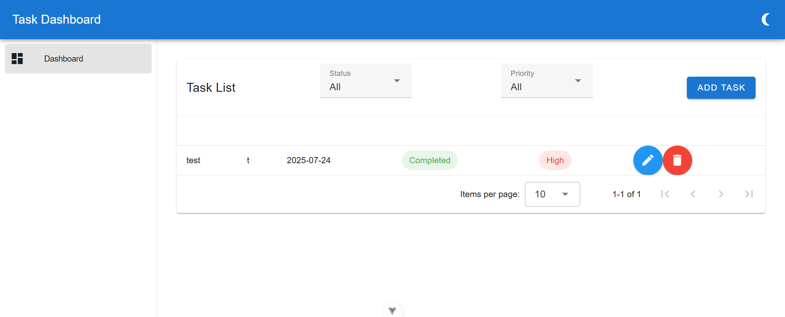
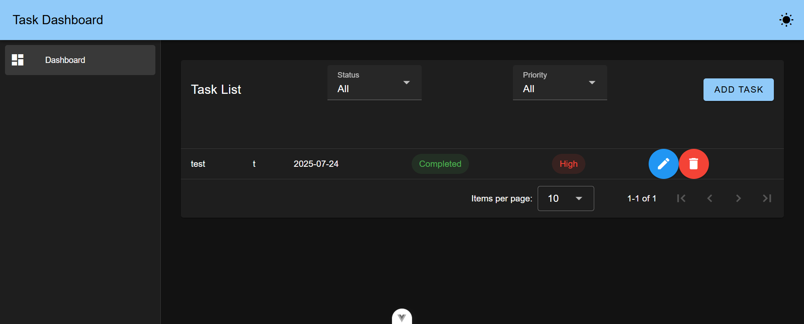
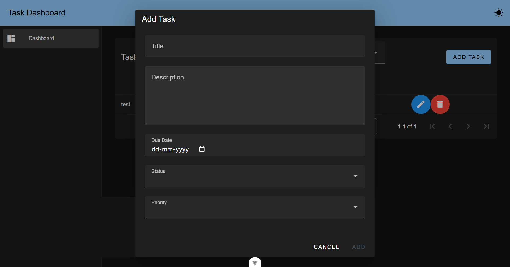

# Vue Task Dashboard

A simple task management dashboard built with Vue 3, Vuetify, and Pinia.

## Features

- Task listing with status and priority
- Create, edit, and delete tasks
- Persistent state using localStorage
- Dark/Light theme toggle
- Modal animations
- Optional: Drag-and-drop and task search


## Screenshots

### 💡 Light Mode


### 🌙 Dark Mode


### ➕ Add Task Modal

## Project Setup

```bash
npm install
npm run dev
